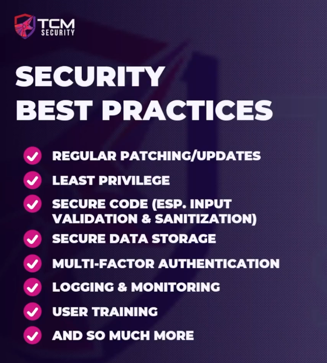

### Web Application Security Standards and Best Practices

CWE - Common Weakness Enumeration

http://owasp.org/Top10/

Definitely a good read!!  Definitely look at.

http://cwe.mitre.org/index.html

Also poke around this.  Good to be familiar with.

https://www.sans.org/top25-software-errors/

All of these are good sites to look at.  Good reference for different things but be familiar with all of them.

