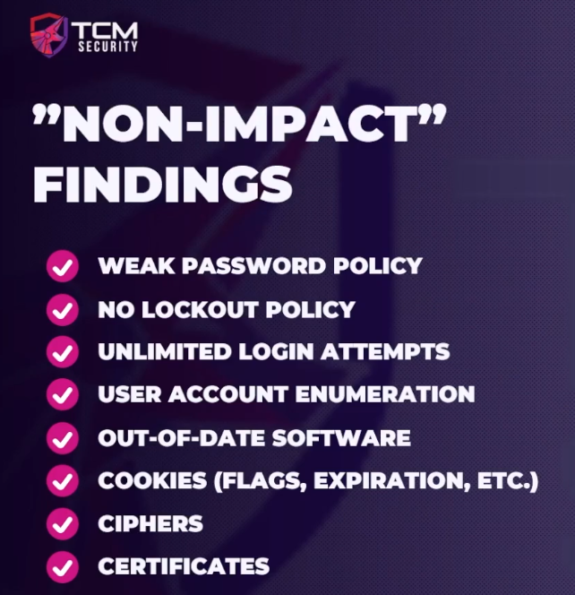

### Pentest vs BugBounty

Bigger the impact, the higher the payout usually is.

Pentest is more 'look at the entire application' vs BugBounty may be looking for a specific bug or set of bugs.

#### Non-Impact Finding

These are more "findings" as opposed to actual bugs.  These may be reportable for a pentest but not so much for a bugbounty.  Bug bounty may come back and ask if there was anything compromised because of the weak password policy or any vulnerability that was exploited because of their out-of-date software.

Bug Bounty really requires impact.  What did you compromise, what info were you able to get, etc.

securityheaders.com is a good resource to quick check websites.  
ssllabs.com is another good site to check website for cyphers and certificates

#### Basic difference

BugBounty - Look for impact.  What can be done with the finding and report that.

PenTest - Look for everything.  Even informational as that would be good information for the client.
