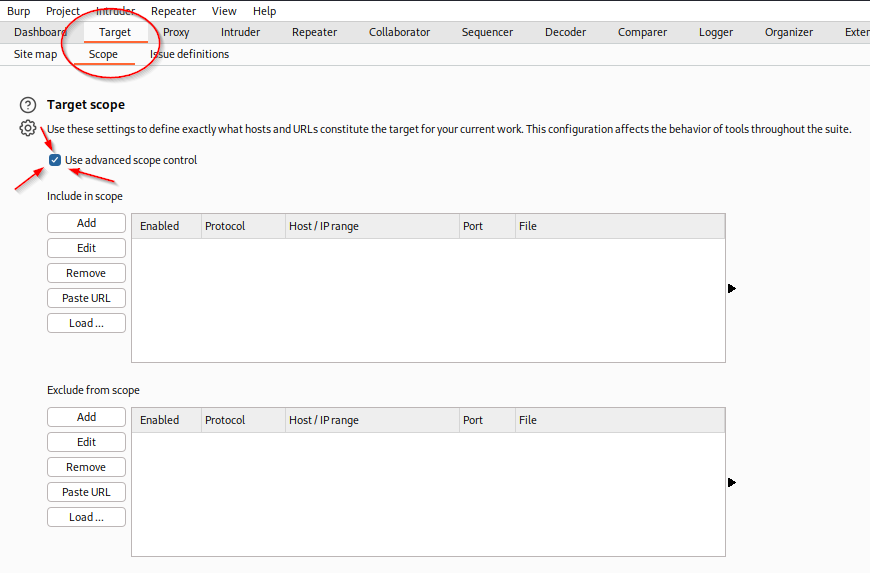
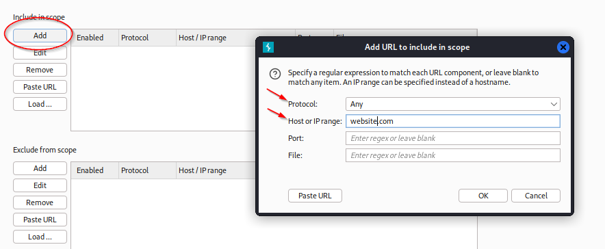
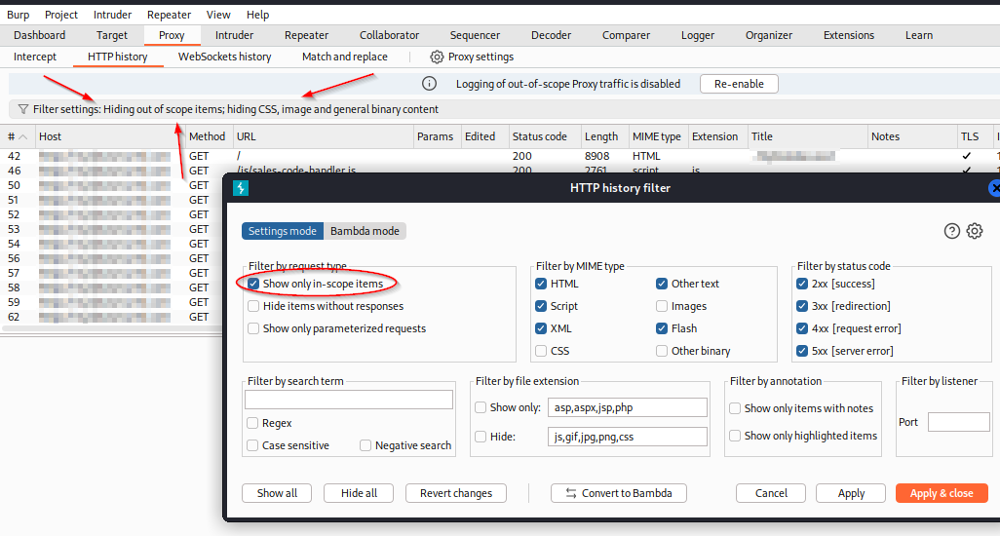
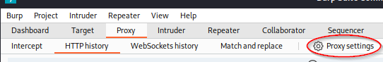
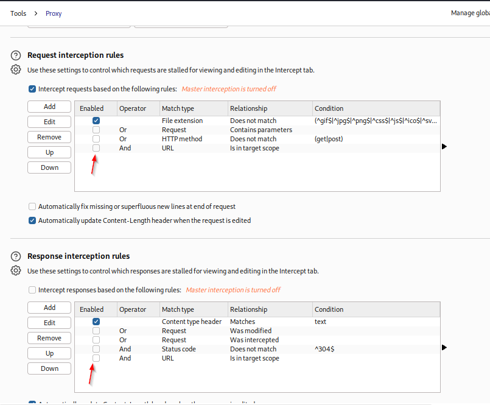
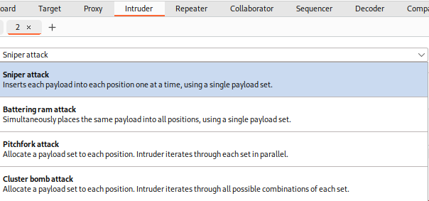

### Burp Suite Overview

Burp suite is a wonderful tool that works as a burp proxy.  It does require some setup and don't forget to add the CA certificate.  Those directions can be found on the web.

Again, it's very important to stay in scope.  There is a meh way and a better way.  Just going to document what I thought was the better way here.

Here, first make sure we're in the Target > Scope section.  Then check the `Use advanced scope control`.  That will change the two boxes below slightly.  Then click on `Add` and you should get the following window.

In the `Protocol` section, select `Any`.

In the `Host or IP range` section, this is important.  If we're going to a site called `www.website.com` and our scope is `*.website.com`, then in this section we're going to put `website.com`.  Nothing before website.  Not even a .

Now, go back to the `Proxy` > `HTTP history` tabs and click to set your filter up to show only in scope items.

This should capture what you want to capture and nothing more.  You can also follow these filter steps in the `Target` > `Site Map` tabs.

When you are capturing and wanting to look at the different traffic going back and forth, you can also set it to only follow and intercept things from what is in scope.

Here, we're goin to the `Proxy` > `HTTP history` tabs and then find `Proxy settings` and then you should get the proxy settings page.  After you scroll down a bit, you should see `Request Interception Rules` and `Response Interception Rules`.

Checking the boxes at the bottom of each section will limit the intercept function to items within the scope that was set a moment ago.

#### Repeater

When you get a request grabbed from pretty much anywhere, you can right click on it and send it to repeater.  This will send the page/capture to the repeater function and the appropriate tab will turn orange.  In that tab you can modify and repeat anything that was sent previously.

You can use this to test different changes and see what the outcome would be.

#### Intruder

You can use this for brute forcing.  The different types are listed.  You can do anything from one single field to cluster bombing a couple different input points.

This is only a high level overview of BurpSuite.  There is also a pro version which is recommended if you are serious about doing this.  It adds a whole lot of features beyond what the community edition gives.