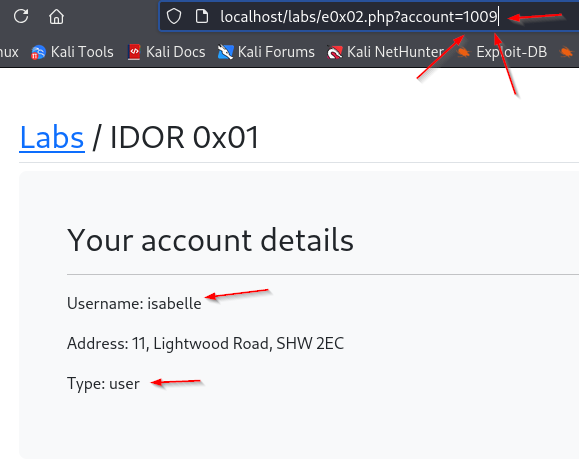
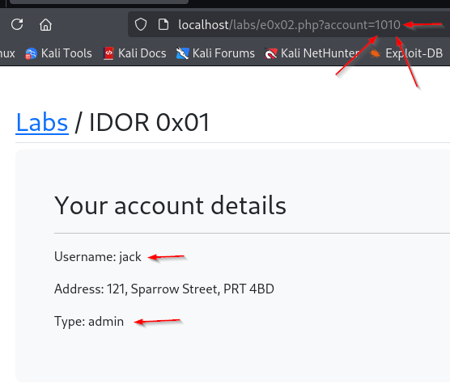
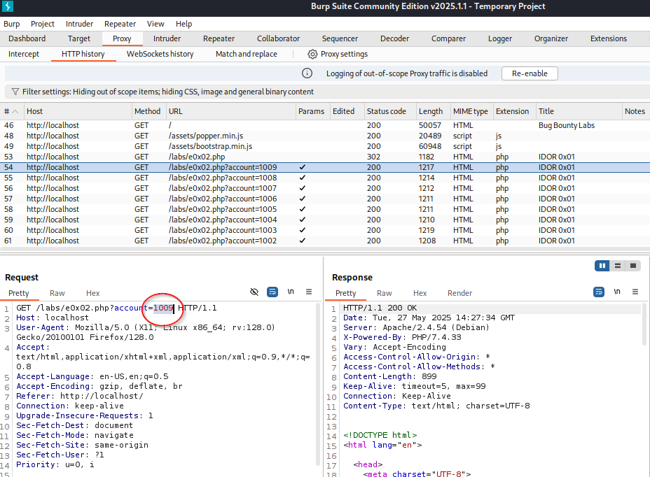

### Insecure Direct Object Reference (IDOR)

IDOR refers to the ability to change a parameter in the url and get to information you wouldn't (and shouldn't) be able to get to regularly.



Here, you start with the URL of `http://localhost/labs/e0x02.php?account=1009`.  If we modify the url to `http://localhost/labs/e0x02.php?account=1010`, then we get the following page.



Simply by changing part of the URL, we are now looking at the info for the admin account.  This is just a simple representation but if there were menu's and options and such in here, you'd have full access to everything on the website.

This can also be done via burp suite.  (If you don't have pro, this can get very time consuming very quickly)



You can also do ffuf, much faster if you don't have burp pro.  You run the url through and FUZZ accordingly, as such.

`ffuf -u 'http://localhost/labs/e0x02.php?account=FUZZ' -w path/to/num.txt -mr 'admin' -c`

-u is the url, -w is the wordlist to use (the one created a little further down), -mr 'admin' is to filter out any results you get back that include the word "admin", and -c cause it looks cool ^.^

Send the packet to intruder and then use a python script to get yourself a list of numbers in a txt file and then use that txt file to load the payload into intruder.

```
for i in range(1, 5000):
	print(i)
```

This can also be done in a cookie or in a header.


For this, in testing, you should make 2 accounts and then test this.  This accomplishes a number of things.  You aren't accessing someone else's account and this permits you to test changing account details from user to user.  This should hold true for API testing as well.