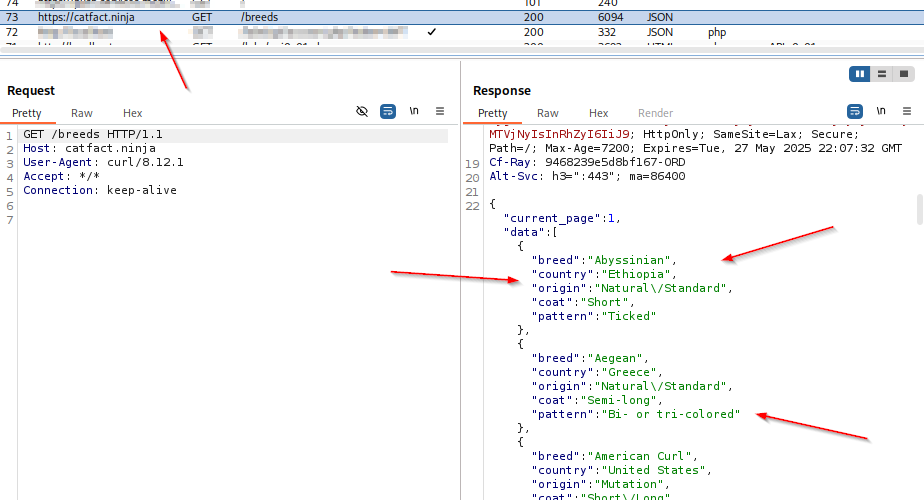

### Introduction to APIs (Application Programing Interface)

Makes it possible to have webpages interact without refreshing the whole page.

Basically the API returns raw data and you use the application to do whatever you want with that data.

This course didn't go very deep into it, hopefully the PWPP will have more API focused material.

`curl --proxy http://localhost:8080 https://catfact.ninja/breeds -k`

Use this command with burp running to proxy it through.  -k will be needed or you'll get a certificate error.  Make sure you are not filtering for some other project or it won't catch.

