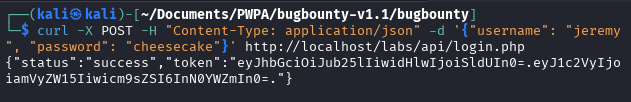
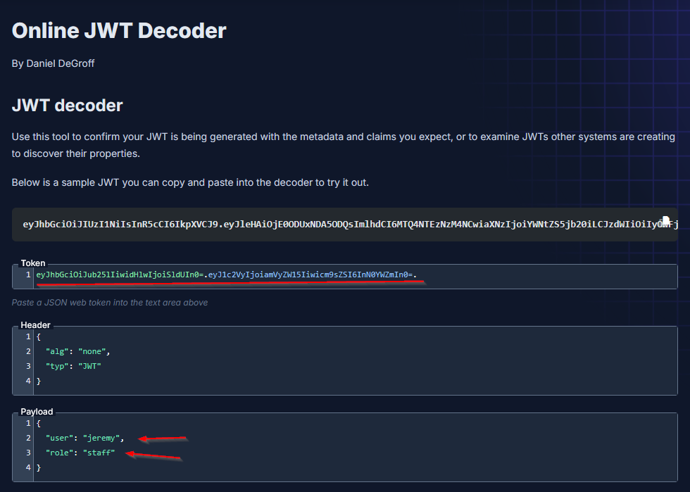
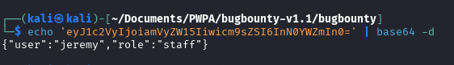
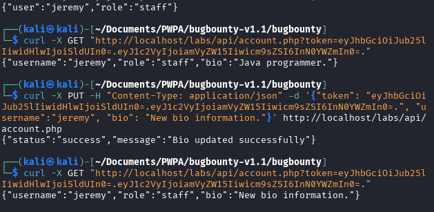
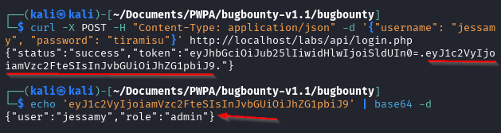
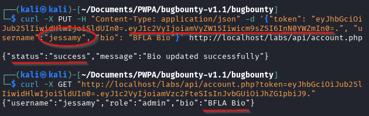

### Broken Access Control

Quick note on this.  It appears in the video that you're to go to Auth 0x05 and it gives you some creds to work with but when I opened mine via docker, it did not have that info so I pulled it from the video.

POST /login.php

`curl -X POST -H "Content-Type: application/json" -d '{"username": "admin", "password": "password123"}' http://localhost/labs/api/login.php`

Credentials - jeremy:cheesecake, jessamy:tiramisu

GET /account.php

`curl -X GET "http://localhost/labs/api/account.php?token=JWT"`

PUT /account.php

`curl -X PUT -H "Content-Type: application/json" -d '{"token": "JWT", "username":"username", "bio": "New bio information."}' http://localhost/labs/api/account.php`

Here, when we use jeremy's credentials with password cheesecake, we get a `"status:success"` and a JWT (JSON Web Token).  The token consists of 3 parts separated by (.) full stops (this one is missing it's 3rd part).

`eyJhbGciOiJub25lIiwidHlwIjoiSldUIn0=.eyJ1c2VyIjoiamVyZW15Iiwicm9sZSI6InN0YWZmIn0=.`

This first part is the header, then the body, and then the signature at the end.  The fact that this one is missing it's signature means we can mess with it.  If there is a signature (which is the case most times), changing that will render the token invalid.

We can take this token to `https://jwt.io` and input it to get some information.  Other places (and where I had to go to find this one) include sites like `https://fusionauth.io/dev-tools/jwt-decoder`.  Not the tool, the methodology!!  In this instance, jwt.io actually didn't work for me and spit back an error when I tried the JWT without a signature.

You can also do this manually as it encoded in base64.

`echo 'eyJ1c2VyIjoiamVyZW15Iiwicm9sZSI6InN0YWZmIn0=' | base64 -d`

Now we can take this token and put it into the correct fields of the other two commands from before (at the top of this page) and we get the following.  We also updated the info and checked it as well.

We've got two though, so let's try the second one out, jessamy.

Here we see we have an admin account.  My guess is that we may be able to move vertically within this api.  Let's give it a go.

So, we use Jeremy's JWT but change the username to `jessamy` and see if it allows us to change information, and wouldn't ya know it, we get a `"status":"success"` message.  BFLA (Broken Function Level Authorization).  We can check it to see if the changes took as well.

This is a very simple example.  There is a burp suite tool called "Autorize".  We'll discuss that next.