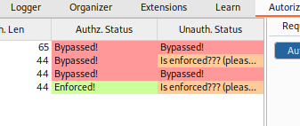

### Autorize - A burp suite tool

Download Jython from web, https://www.jython.org/download and you're looking for the Standalone JAR file.  Once that is in, go to the Extension Settings page and set that in your Jython standalone JAR file under the python environment.  Close that and refresh the app page and you should be able to install Autorize now.

Once that's installed, you get a new Autorize tab.  What Autorize does is takes a JWT and will use it anytime a request is made that requires a JWT token, it will repeat that request with the token supplied.  In this example, we're going to take jessamy's token in the burp suite app while running commands with jeremy's token to check jessamy's token.

As seen, you can see along the top tabs, you see Autorize.

At first, Autorize is turned off, make sure you turn it on.

A little below that you see the text box section is where you put the cookie.  Here, you'll notice that jessamy's JWT has been added with the `Cookie: session=`

Once that's done we run the following command and you get the output that you see.

`curl -X GET --proxy localhost:8080 "http://localhost/labs/api/account.php?token=eyJhbGciOiJub25lIiwidHlwIjoiSldUIn0=.eyJ1c2VyIjoiamVyZW15Iiwicm9sZSI6InN0YWZmIn0=."`

Here you see Authz Status as "Bypassed!" and the Unauth Status as "Bypassed!" as well.  This means you have a vulnerable API.  You may also see "Enforced" meaning the API is not vulnerable to this type of attack.  If you see "Is enforced??", that will require further investigation.

