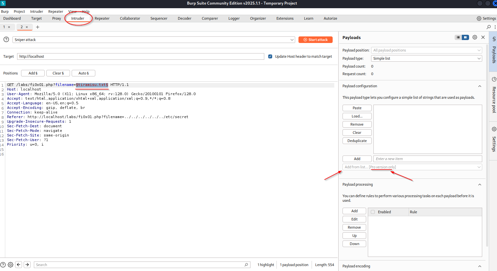
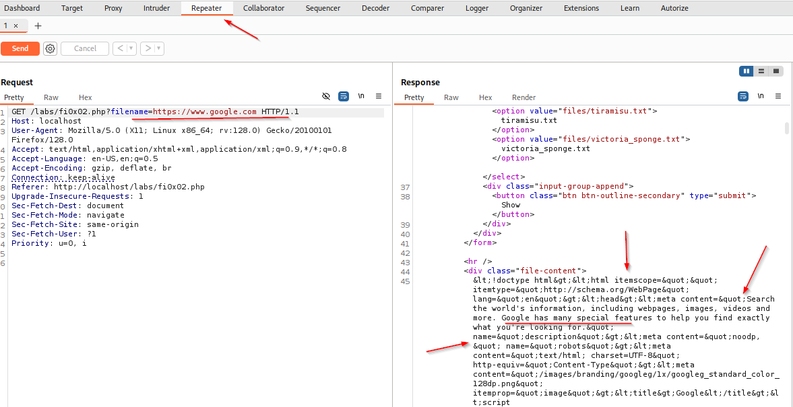
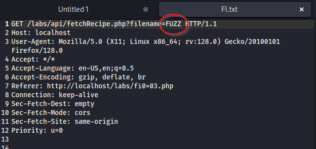
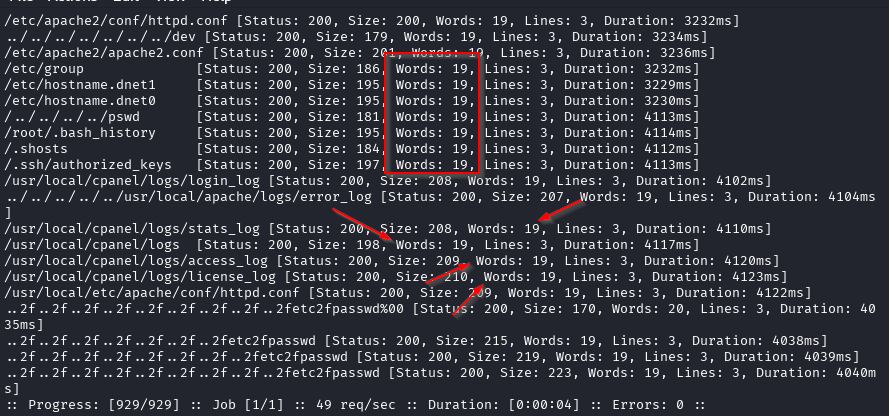
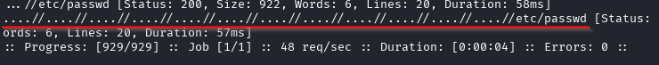
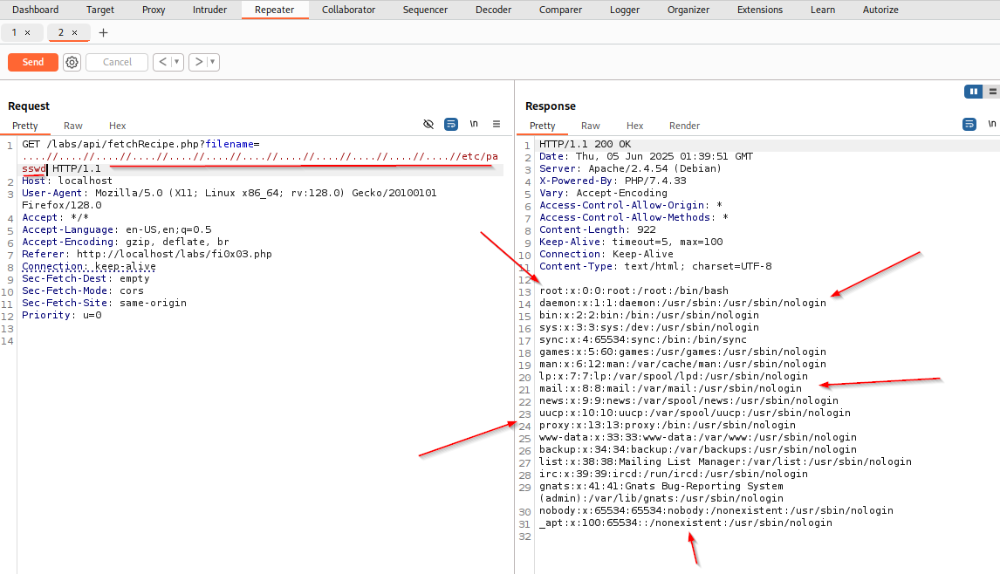

### Local and Remote File Inclusion

#### Local File Inclusion (LFI)

Accessing files on the server that you are not supposed to.  An example would be a recipe site that has a list of different items you can look at.  If you can make one of the files on the device show up

Payloadsallthethings github has a good section for this.

With Burp Suite you can test for a large number of directory transversal items.  We can also FUZZ this in Burp (and use a premade list with Pro version).

I would assume you can use ffuf in the same way here for faster (non-burp pro) speeds.

For both of these, you may sometimes find that your entry is filtered out.  You may check to see if the filtering is recursive.  This means that you would try the following and if the filtering is not recursive, it could get through.

`filename=..././..././..././..././..././etc/passwd`

This passes the non-recursive filter because it removes the "../" in the middle but once that has been removed, there is another "../" there that isn't filtered out.  This also works for things like having `http` filtered.  You can put `hthttptp` or even `hTtp` to get past filters that are weakly built.

#### Remote File Inclusion (RFI)

Tested by using google in the GET line request.  If it returns the page source inside the app then it's likely you can grab whatever file from whatever server and possibly run it.  Testing using google is simple enough.

Payloadsallthethings File Inclusion section has a lot of good resources. Going through those can be useful as well.

#### Using FFUF

Take the api call packet and save it to a file.  And then add your FUZZ point.

Once we've done that, we can carry out our fuzzing with ffuf.  (Side note, J Haddix is a good resource to look up)

`ffuf -request FI.txt -request-proto http -w /usr/share/seclists/Fuzzing/LFI/LFI-Jhaddix.txt`

This will give us a lot of results but in those results we can look for what to filter out.  We can see that a number of them return with 19 words so let's filter that out.

`ffuf -request FI.txt -request-proto http -w /usr/share/seclists/Fuzzing/LFI/LFI-Jhaddix.txt -fw 19`

With this we still get a lot of results so if we filter out 20 as well, we can really narrow this one down.

`ffuf -request FI.txt -request-proto http -w /usr/share/seclists/Fuzzing/LFI/LFI-Jhaddix.txt -fw 19,20`

At this point, we can see a number of results that appear to indicate that we have LFI.  Check it in repeater and we do, in fact, get the etc/passwd to print out.

As you can see, we used the one that we got a hit on from the ffuf command and used that in repeater on Burp Suite to test and verify that we do, in fact, have Local File Inclusion.