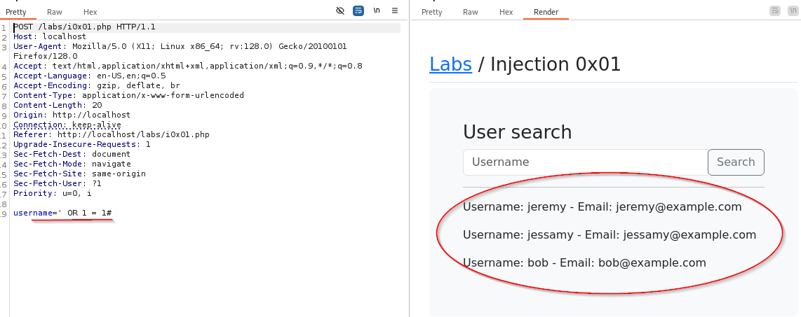

## SQL Injection

You can test by using different characters that are used in SQL statements (i.e. ' or ") and seeing if it returns any errors.  We should also spend some time using the application to see what it's functionality is supposed to be.

Often times we likely won't get much as the application will "fail gracefully", meaning you don't get any info back, but sometimes you might get info such as version numbers or tables or something to give you a bit of insight.

We can also check with logical operators (and, or) to see if we can get anything.  For example, putting in `jeremy' or 1=1#` may return a list of things.  The `#` is a terminator in SQL statements.



### Basic SQL Injection

Using UNION statements to get information from other tables.  When you use `UNION SELECT` statements, you have to use the same number of columns as the original request.  Meaning, if the original statement asks for username and password, you can only get 2 columns from another table, not 1 or 3+, only 2.

How to find out how many are being asked for, we can use the following...

`bob' union select null#`

This one returned with no users so that's not the correct amount since we know that there is a user named bob.  So we increment it out will `null` and see how many it takes.  Here, we ended up with 3 to get a result.  Please note, you don't need the spaces between the nulls.  `null,null,null` will work just as well as `null, null, null`.


So now we know that this one requires 3 columns in our select statement.  Now we can do things such as this...


Here, we replace the last null with `version()` and it returns the version number of the database.  We can use that info to find more on default settings and possible other vulnerabilities in that database.  We can also get the table names from the database with this.


With the line `username=bob' union select null,null,table_name from information_schema.tables#` we are able to get all table names.  You'll notice there are still more that we can scroll to.

Using `username=bob' union select null,null,column_name from information_schema.columns#` we can get the information on column names.  And again, you see there are more results as we scroll down.


Earlier we pulled the table names and we just now got the column names.  So now we can use our `union select` statement to pull passwords with `username=bob' union select null,null,password from injection0x01#` and we get this.


You'll notice that we didn't just get bob's password, we got all the passwords.

Something that may come into play.  We know in this example we have 3 columns being returned.  What if that first column is an ID number stored as an integer.  We can only call an integer in that first column.  Where we have the first `null`, if we replace that with something, the output has to be an integer.  We can test this by using simple items like a number in place of the `null` or `null(int)` and see if we get an error or not (if you get something returned or not).

There is a good cheat sheet from Port Swigger (https://portswigger.net/web-security/sql-injection/cheat-sheet) to check out as well to answer more questions and give syntax tips.


There may also be other avenues to take.  In the lab 0x02, we try the above and no matter what we try to input in the username or password field, it's not giving us any information.  We do, however, see a cookie session getting set.


Here, we enter the correct username and in the POST packet and we get a response with a `Set-Cookie:` and a session hash.  In the response to that, we see that this cookie is now part of the request.


We see here that the `Cookie` is set with the session that was given back to us from the POST request.  And we see that in the response we have "Welcome to your dashboard!" meaning we've signed in successfully.

We can send this to repeater and test some things on this cookie cause the application must be using that cookie somehow so let's take a look.


Here, all we did was add an `a` at the end of the cookie and now we're presented with the login screen again.  If we change the cookie back to what it's supposed to be by removing that last `a` it takes us back to the dashboard.  What if we add some SQL to it?


Ahh, if we add `' and 1=1#` we don't get the login page, we stay on the dashboard.  This is a good indicator that we can inject some SQL into this cookie.  This is actually Blind SQL Injection.

### Blind SQL Injection

Blind SQL Injection means that you aren't getting any data back, you're just changing the behavior of the application (ex. It will display the login page or the Dashboard page in this instance).  With this, you build a query that will iterate through and return yes or no depending on what is asked.  You ask questions like "Does this account's password start with an 'a'? With a 'b'?" and so on and you can build out the password using the responses.

We do this with the MySQL SUBSTR() Function - w3schools.com has a good page on it.

`SUBSTR(string, start, length) = 'z'#`

`string` - This is the string you are matching against.  This is where you would put your sql syntax to grab the field you want to test against.  
`start` - This is the position you start at in your `string`.  
`length` - This is how many chars you go from the starting point.  

As an example, if we have the following...

`' and substr('alex', 1, 3) = 'ale'#`

Here, we're checking against the string `alex` and we start from the position of `1` and go out `3` characters.  It's worth noting that this is not like programing where your first position is `0` instead of `1`.  This statement would return `TRUE` and thus we would get the dashboard page in the previous example.


If we wanted to, we can change the `string` portion (here, `'alex'`) to `(select password from injection0x02 where username = 'jessamy')` and change a couple of the other items like length and the = part like so...

`' and substr((select password from injection0x02 where username = 'jessamy'), 1, 1) = 'z'#`

We would run through the alphabet where the last `z` is at the end and go until we got the dashboard instead of the login.


So now we know the first character of jessamy's password is `z`.

This would be very tedious though.  In order to do this faster, we're going to use SQLmap.  Will pick this up at the bottom of the SQLmap section.  You can use burpsuite intruder as well, just change the place number in the syntax and have intruder go through the options in the `= 'z'#` where "z" will be the insert point.

### SQLmap

`sqlmap -r sqlmap.txt`


With SQLmap, you'll take any packet that you have interacting with any type of sql data and save it to a txt file.  Then use that txt file to run the sqlmap tool.

You'll probably get some different prompts, read them through and understand what they are asking and how it pertains to what you're testing.


Here, we have under the red underlines, saying that it does not appear that the `username` and `password` inputs may not be injectable.  Since this is in lab 0x02 and we checked those ourselves before looking at the cookie, this is correct.  This did not have the cookie parameter in it so it wasn't tested.  The underlined Green area is of import when doing a real world test.  In labs you may choose `n` and let it run the union tests.  In real world, you may opt to skip those with `Y` (which is also the default) as it could potentially lead to unintended consequences.


In this screenshot, we see that the `password` field is not likely injectable but we also see that all tested parameters do not appear to be injectable.  At this point we can look elsewhere or try some manual testing.

(cont from `Blind SQL Injection` section)  

Continuing right where we left off.  Here we want to test the cookie value.  In SQLmap, that requires level 2.  So here's our syntax.

`sqlmap -r req2.txt --level=2`

Running that will show us that this is an injectable parameter.


As you can see here, it shows that this an injection point.

`sqlmap -r req2.txt --level=2 --dump`  

This command will dump database information for all found tables.  If we want a specific table we can use the following...

`sqlmap -r req2.txt --level=2 -T <tablename>`

The `-T` will give just the table name you put in.


As we can see with our specific results, we have both passwords now.  We can modify this to show whatever table output we can get to.

### Second Order SQL Injection

The idea here is that you may not be able to directly get sql injection going but you may be able to store some sql code into the database and see if that allows you to execute your injection attack.

For example, a log in page and account creation page.  If we test and we are unable to get sql injection from the inputs, perhaps we can get some sql stored somewhere (like say, in a username) and get it to run later in the process.

Create a user named `test` and then log in with that user and we get this...


If we use that same form to create a user named `' or 1=1#`


We see that we get everyone's bio now.

### Setting up a sql database to play with

Starting mysql service - `sudo systemctl start mysql`  
Login to mysql - `sudo mysql`  
Create database and tables  
```
CREATE DATABASE sqldemo;
use sqldemo;
CREATE TABLE users (
	username varchar(255),
	password var char(255),
	age int,
	PRIMARY KEY (username)
);
```

Insert some data
```
INSERT INTO users (username, password, age)
VALUES ("jeremy", "letmein", "30");

INSERT INTO users (username, password, age)
VALUES ("jessamy", "kittems", 31);
```