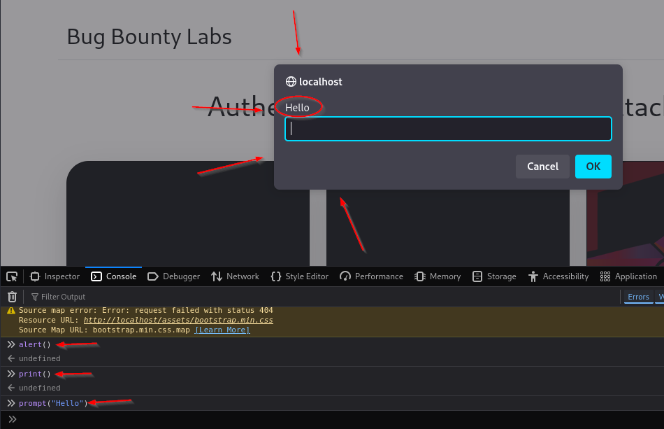
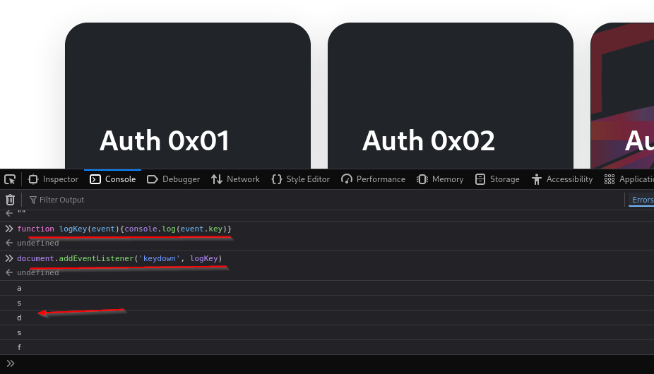
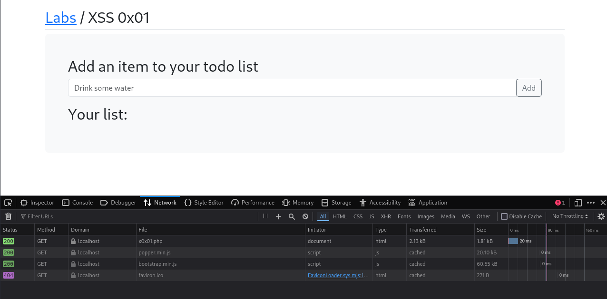
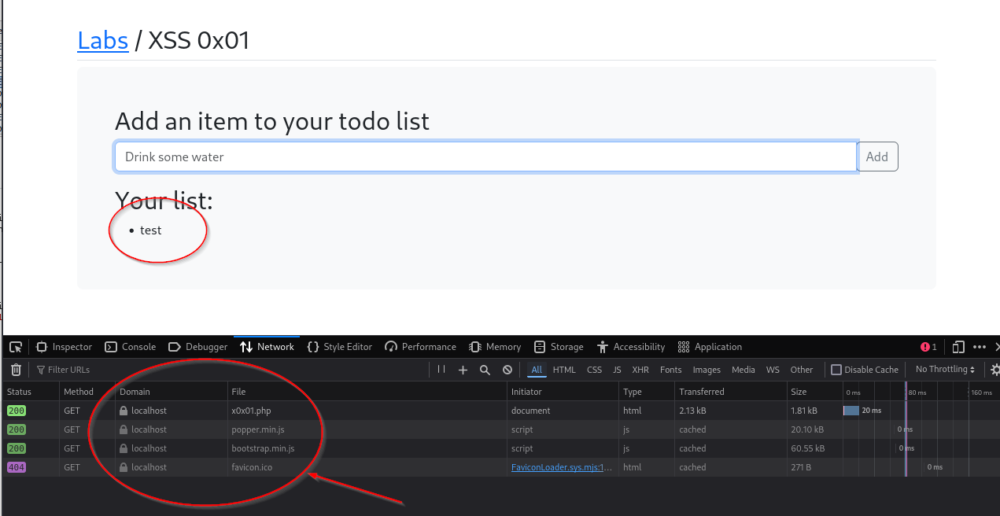
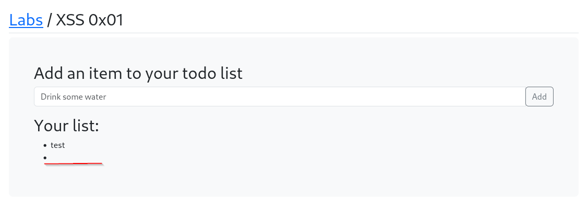
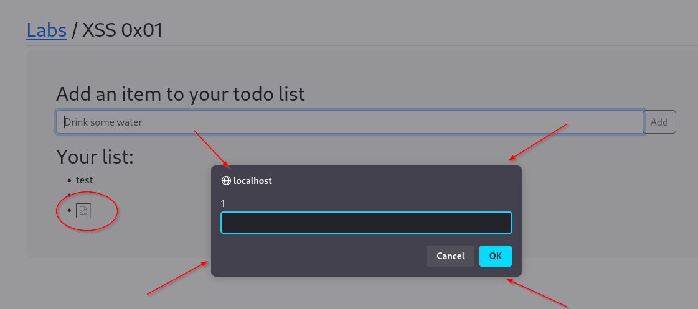

## XSS (Cross Site Scripting)

Cross site scripting, or XSS, is when you execute javascript into the victim's browser, often giving us control of the application for that user.

XSS is also very flexible and can be used to chain other issues together.

There are 3 main types:

Reflected - This is when the script is included in the response from a web server.  You send a request injecting some javascript and you get it back in the response. This is limited since you can really only do it to yourself.  However, you can use this as a base to test as well as possibly putting a url in the javascript and trying to get a user to click on it.   

Stored - This is where the injected javascript is stored on the database and then served to anyone that visits that site.  

DOM-based - Everything happens locally in the browser.  

### Testing

While in the browser, you hit CTRL + SHIFT + C and it should give you the dev tools for the web browser.  You can then go to the console and try a number of things.

Here we try 3 payloads and all worked.

`alert()` gave us a popup  
`print()` opens the print window to print off the page  
`prompt()` as you can see opens an input window with the text that was put into the ()'s  

Using `alert()` in this manner is not recommended.  Not because you'll break something but because it may be blocked where other things aren't.  Use `print()` to open the print window or `prompt("message")` to test and see.

You can find more deets at `https://portswigger.net/research/alert-is-dead-long-live-print`

With XSS we can create a simple keylogger.

`function logKey(event){console.log(event.key)}`  
`document.addEventListener('keydown', logKey)`  

When we put these two lines in and then click back into the window and start typing, we get the key pressed showing up in the console.  We can change the `{console.log()}` part to a collection API or something similar in order to grab keystrokes and potentially passwords or other info typed in (credit card numbers, ss#'s, etc).

### XSS 01 (Basic XXS)

Here we have a DOM based scripting attack.  We can tell this by opening the dev tools, looking at the network tab and seeing that there is no network traffic each time we submit an item.  Also, if you reload the page, you lose all the items placed into the list.

A common test payload is `` but when we submit that, we just get a blank bullet point.  The reason is we aren't actually loading that code.  If it were loading, it would execute, but if we refresh the page all those items go away and it's not executed (being a DOM based attack).

So, we have to get creative with our payload.  Something like `` will try to load an image and when it does error out, since there is no image at /x on the server or anywhere reachable, it will run the `onerror` section of the code.

As you can see on the page, the image fails to load, we even see the "broken image" item in the list.  But we get the prompt.  Success!

Now, let's see if we can get something else to pull up in the window.  By using `` we can forward the site to any site we want (in this case `https://tcm-sec.com`).

### Stored XXS Attacks

Stored XXS is when the injected script is added to the page, like in a message board and adding a comment.  It's called stored cause it's stored on the server and anyone who loads that page will have that script run.  For example, if we come across a message board and the input is not properly sanitized, we can enter things like `` and if we refresh the page, we get the prompt window.  If we add another comment, we get the prompt window.  Every time that page loads, we will get the prompt window until an admin goes in and removes that post.

You can also test quickly with something like `<h1>Hello</h1>` and see if the text "Hello" comes back in the `h1` format.

To really be able to check this and make sure that it's not just storing the message in your session, you can use Firefox containers in order to have multiple accounts through different tabs to the same site.  That way you can test across accounts.

The challenge exercise involves a ticket submitting system that is vulnerable to attack (stored I believe) and it grabs an admin cookie without letting the user know.

You can use a site called webhook.site in order to give your payload something to point at.  Inserting `` with the webhook.site address, along with the `/?` to make the cookie a parameter and then append (`+`) the cookie with `document.cookie`

When testing this in real world, you won't use sites like webhook.site.  You can spin up a webserver to catch traffic in a variety of ways that don't involve a public website that might collect user data.