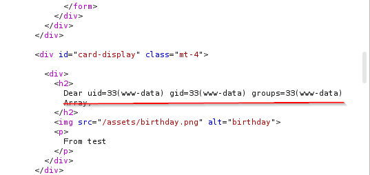

## Server-Side Template Injection (SSTI)

Template engine allows us to separate the presentation layer from the logic layer in our application.  This can allow us to, if we know the proper syntax, inject some code into the template and have it execute.  Some common ones are ginger 2, twig, erb, freemarker, and handlebars.

While we are focusing Server-side in this, it's also possible to have client side.  Again, the client side is done by the browser and server side is done on the server itself.

This one was actually pretty simple.  In the lab, we can also test and see that this application is subject to XXS as well but we've already covered that.

Here we use Burpesuite to fuzz for some items.  i'm sure you might be able to do other fuzzing tools as well but this seems to work the best for this one as you won't get many uniform responses.

Here we have our payload in intruder was selected as the seclist shown below.

Using that to fuzz the application, we get a number of responses.  Check the smallest and largest reply and we get something interesting with the larger replies.

Here we get in the response, an error.  We can get info from errors.  Here we see it's using twig.  So now we can go out to the interwebs and get some SSTI payloads.  Here we searched for `SSTI hacktricks` and got some payloads.  We gave `{{['id']|filter('system')}}` a try and guess what we get back.

Here we see that we get the `id` of the user, `www-data`.

You may also find that sometimes it appears like you aren't able to get this to work.  Use burpsuite to verify that some browser based java script isn't keeping you from seeing the output.  You will need to check the response source code to see it but if you can pull the attack off, the info will be there.

Also, with this, remember that depending on the template engine being used, the payloads will vary from one another.  Make sure you are using the right payloads and that you are checking for possible code execution.