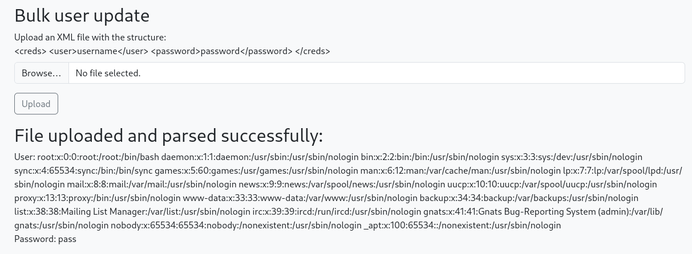

## XML External Entity (XXE) Injection

XML, or Extensible Markup Language, allows you to use brackets, `< >`, in order to lable and transmit data such as the following...

```
<?xml version="1.0" encoding="UTF-8"?>
<creds>
    <user>testuser</user>
    <password>testpass</password>
</creds>
```

Here you have the `<creds>` for a user with it's `<user>` and `<password>` fields.  You always close off your brackets as well, such as `</creds>`.  Much like javascripting.

This is likely to be an internal type of application but if you find something like this facing an external website, it's definitely reportable.

You can take advantage of this with something similar to the following...

```
<?xml version="1.0" encoding="UTF-8"?>
<!DOCTYPE creds [
<!ELEMENT creds ANY >
<!ENTITY xxe SYSTEM "file:///etc/passwd" >]>
<creds><user>&xxe;</user><password>pass</password></creds>
```

What's happening here is you are using the `!ELEMENT` inside `!DOCTYPE` and giving the `!ENTITY` (in this case, `xxe`) and giving it the value of `"file:///etc/passwd"`.

When we pass this into the application we get this.



Searching PayloadsAllTheThings will also give a number of different types of XXE payloads.

Also, it's worth checking API's that expect JSON data with XML format data as it may accept it and then you may be able to pull this attack off after all.