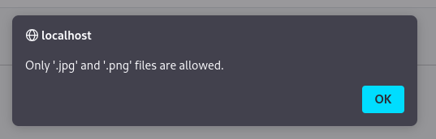
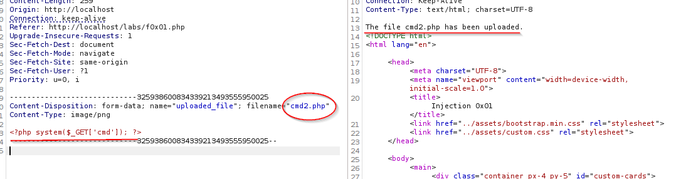
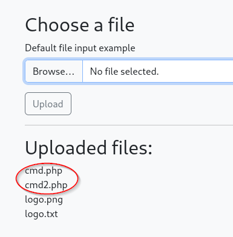
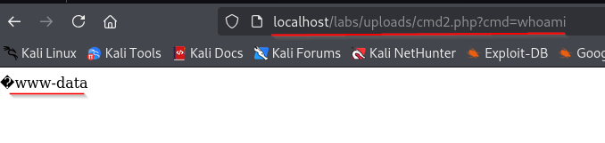
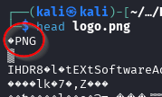
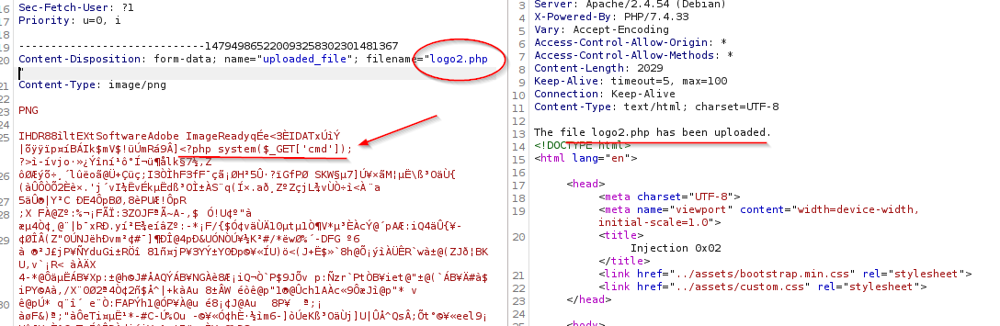
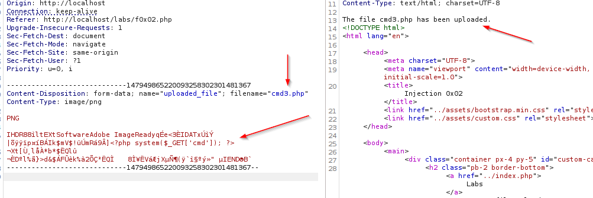
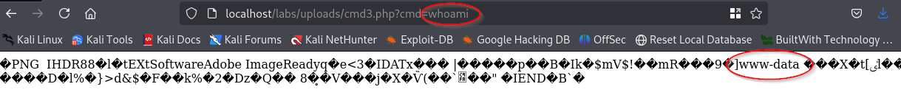

## Insecure File Uploads

File upload functions offer a number of testing vectors to try.  What you are looking for here is generally remote code execution (RCE).

### Client-Side Controls Bypass

In this example, we see that we have an upload function.  If we try to put anything in there other than a .jpg or .png image, it kicks back an error.

If we check the dev tools and the network tab and then refresh the page and try again, we see that there is no network call that is checking the file, so it must be done in the browser.  Well, we already know how to get around that.

Fireup burpsuite and send a legit .png file.  We can grab that legit .png upload and send it to repeater and then change the file information and we are able to upload a .txt file without issue.

We can take that same request and add the following...

`<?php system($_GET['cmd]); ?>`

Here we change the filename to a .php, change the contents to the php command, and when we send it, we get a response saying the file has been uploaded successfully.  We also see it show up on the page with the "Uploaded Files".

We have a couple here because I messed the first one up with a typo but as you can see, we also have a .png and a .txt file uploaded.  But now that we have our .php file uploaded, we need to find it to use it.  We can do that with `ffuf` and we find that it's in the `labs/uploads` directory.

When we navigate to the following, using the end of the line to give it the command that we want to execute, `http://localhost/labs/uploads/cmd2.php?cmd=whoami`, we get the following back.

And now we can pass whatever command we want from that prompt.

### Server-Side Controls Bypass

Sometimes, you will try the aforementioned method and when you attempt to bypass the browser control, you still get the "only these files types are allowed" error.

In some older web servers you might be able to get away with doing `filename="cmd.php%00.png"`.  The `%00` is called a 'Null byte' and it will terminate out anything after it.  If the `.htaccess` file is not configured correctly, you may even be able to leave the null byte out, using just `filename="cmd.php.png"` and it will still read as a .php file and execute the code.

There are also some other ways that you can upload a special file, like an .htaccess file that allows you to execute files with extensions like .asd as if they were .php.

You can also change the `Content-Type` field though this doesn't change the way the file is stored but if it's not showing as `image/png` or another image type, you might be able to change that and get past the filter.

You can also check something called `Magic Bytes` which are the first few characters of a file to let the program know what type of file it is.

If we upload an image file and capture that, we can modify it in burpsuite and get our file to upload.

Here we were able to leave the text portion of the .png file with it's magic byte at the top (the PNG).  We just copy and pasted our code into the text of the image, changed the name of the file to reflect the .php extension that is needed, and there we have it, our file uploaded successfully.

Let's give it a try now.

That still kicks back an error.  We actually need to remove some of the extra characters as long as we don't touch the magic bytes.  We also need to leave a bit before and a bit of the end to get it to really take.  After some trial and error we finally get it to go.

Using that, we get this...

You may also find different file extensions may not be filtered.  You might see .php filtered but what about .phtml, .php3, .php4, etc?  Also, .asp could be filtered but check .aspx and others.

Portswigger also has a good resource for other Insecure File Inclusion tidbits ^.^