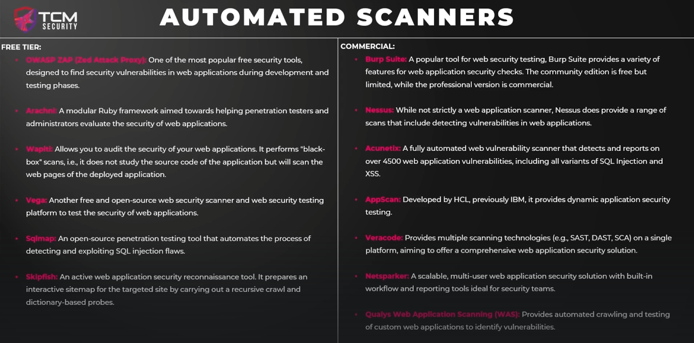

## Automated Scanners

This list is not all inclusive but this will give some idea as to the amount of tools that are out there.

Some bug bounty programs will ask you to not use automated scanners.  Pay attention to the scope of any engagement.  For bug bounty programs, vuln scanners are likely not going to find anything that you are looking for anyway so probably best to stay away from them, especially when first starting out.