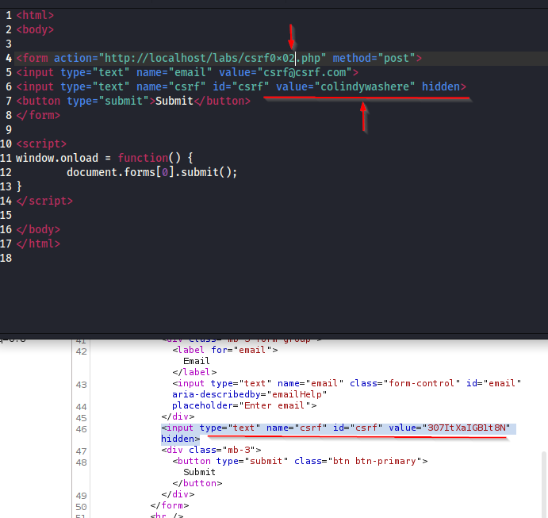

## Cross-Site Request Forgery (CSRF)

Trick a user into performing an action within a web application that the user is authenticated to.  This could be to change settings, posting to forums, or even make money transfers.

We need a legitimate session.  Let's say we have a website that we use to pay someone.  The victim user would need to be signed into that site and then visit a malicious site that would run a script of some kind (XSS) that would instruct the browser to perform an action at that website using the victim's credentials and account.

Here's how it goes...

First we sign into the test account of jeremy and we are presented with an email change page that has a form in it.


If we look at the page in burp suite, we can find the form section in the code.


We then take that form and clean it up a bit.  We don't need the `div` parts or the the style, class, or id parts.  Add the `<html>` and `<body>` tags to it after we clean it up and we should have something close to this.  We also have to add the full url since it's being run from outside of the site and not internally in the form.


You'll notice the form action and method.  Full URL as mentioned previously.  All the style stuff has been removed as well to make the code a bit easier to read.

While this is good, this will open a page and all you will get is the form and a submit button.  Will look quite iffy and most people will not fall for it.  So we need to add something more to this to get it to really work more often with less user interaction.

```
<script>
window.onload = function() {
	document.forms[0].submit();
}
</script>
```


By adding this to the page we just made the script run when the page loads.  You'll also notice that we added a value to the input line to make sure that it does, in fact, change the value in the page.  Now we just load that html page in a different browser tab and you'll see the email changed.


Sometimes (most times probably) you will find a csrf token on the page.


Here in the form we see a hidden field that is giving the application a token value.  We can test a number of things with this.  Does the app actually check the value or just that one is there?  Does it have an easily guessable token?  What if you use a previous token?  Can a token be used across different accounts?

If we run out of ideas while trying to get around this token, appsecexplained.gitbook.io has a good CSRF checklist to work through.

Here, we're going to check whether the token is checked by the value of the token or only the presense of any token.

So we change the URL to the updated lab and add in the `<input type="text" name="csrf" id="csrf" value="307ItXaIGB1t8N" hidden>` line but we change it slightly.  We change the value field.



And success!!  This means that the value of the token itself does not matter, only that there is a token present.  This is a problem for the client and would need to be reported.


