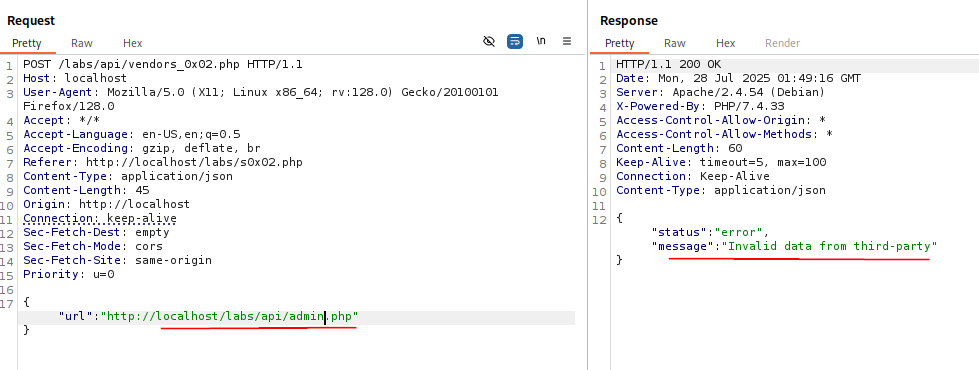

## Server-Side Request Forgery (SSRF)

In this attack, we trick the server into making requests on our behalf, thereby using the server's credentials instead of our own.  This can target internal systems and resources which may be otherwise unreachable to us.

A web application that takes user input of a url and displays the image from that url.  If not properly secured, this may be used to point at internal resources as a way to use the servers credentials to access those resources.

Here, we're looking for an application that makes a call to a website.  In the example, it's an API call to a website to check a price.

As you can see, the app makes an API call and get the success message back with the price that it should show.  So what happens if we FUZZ where the call is being made?

`ffuf -u http://localhost/labs/api/FUZZ -w /usr/share/wordlists/dirb/common.txt` gets us the following output.

Interesting, we see an admin page.  Lets try to navigate to it and see what we get.

Not completely unexpected, we get access denied.  Fair enough.  But what if we get the server to make the request for us?  Send that original packet to repeater in burpsuite and give it a go.

Would ya look at that.  This is an instance of the server having access that we don't have from the outside.  This is SSRF.

At this point we can script going through internal IPs and then once we get IPs we can use scripting again to check ports of those IPs.  Always remember though, make sure you follow scope.  If internal systems are not in scope, where we stopped here will be the end of it.

### Blind SSRF

Sometimes you may get the following though.

Here, we put in the same information but we get a different response.  This one does not give us the success we crave.  So, give up?  Not a chance!  There's likely some backend check and it appears on this app that it's expecting certain info.  However, we can still verify SSRF, just may not be very exploitable.

If we go to webhook.site and grab ourselves a webhook, we can give it a go.  Again, if you're working with sensitive info, best to spin up your own webserver in some form or fashion as opposed to using webhook.site.

Nevertheless, we see that even though we do get the Invalid response, we do have internal server hitting a website on our behalf.

As we see here, we can still get the server to process items on our behalf.  If we were malicious, we might have a different site setup in a way to make the requesting server do things it's not supposed to do and we can force it to hit that site in this way.