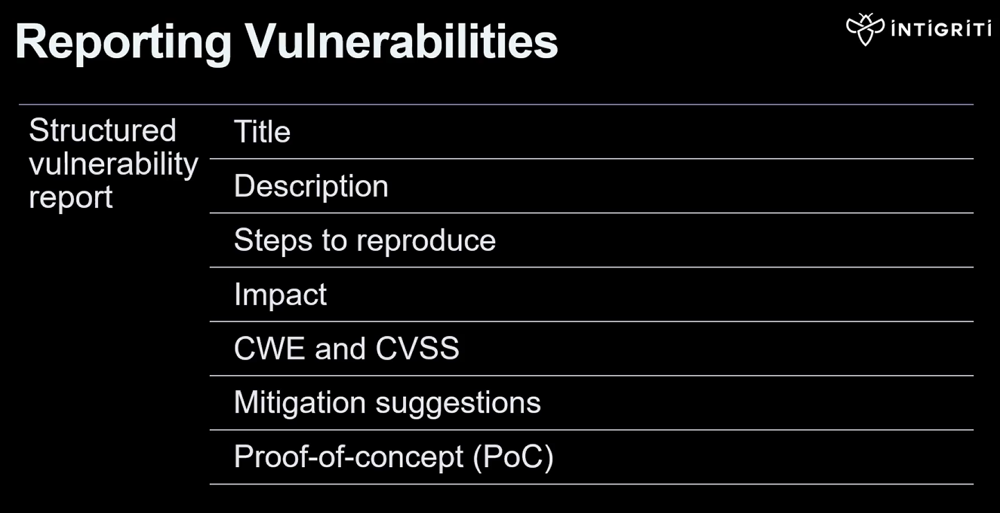
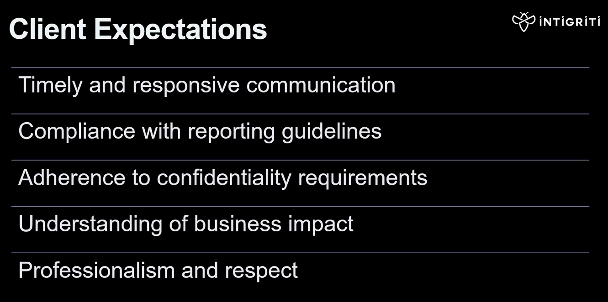
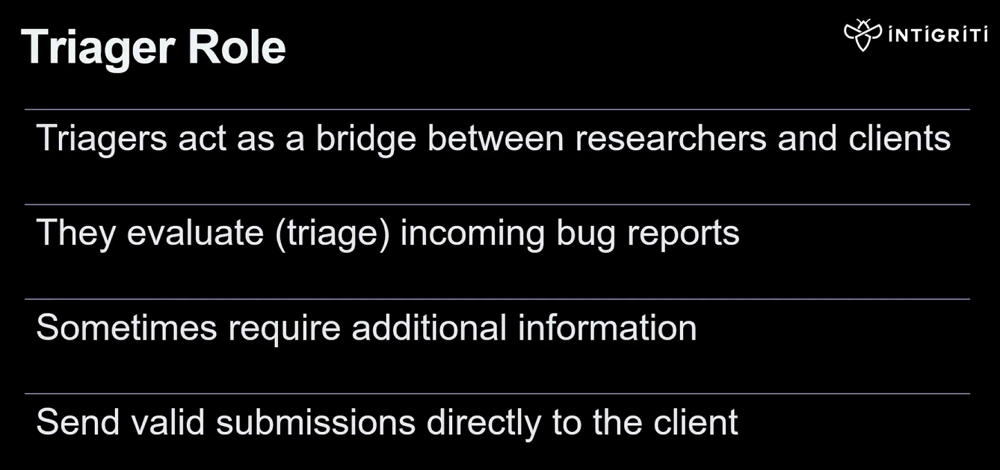
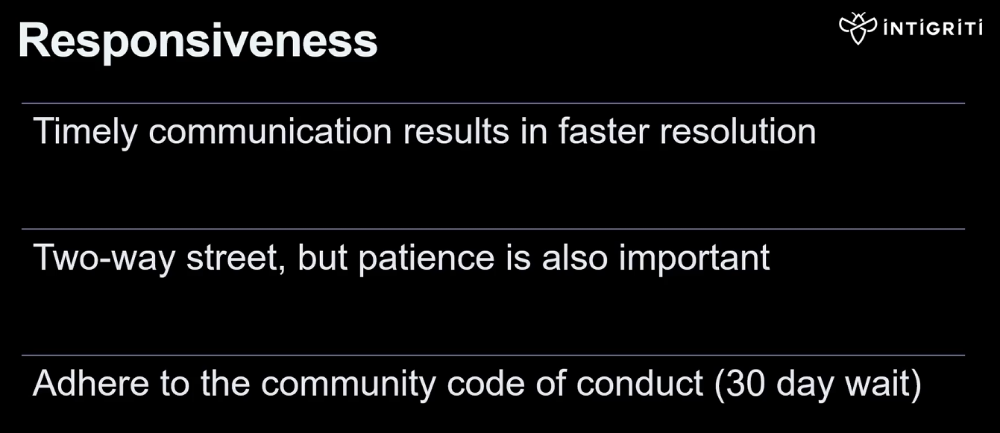
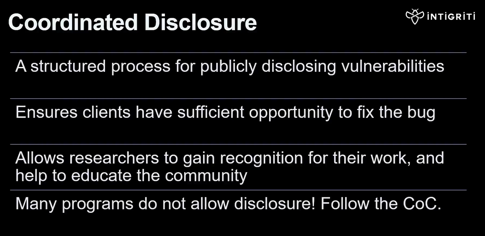
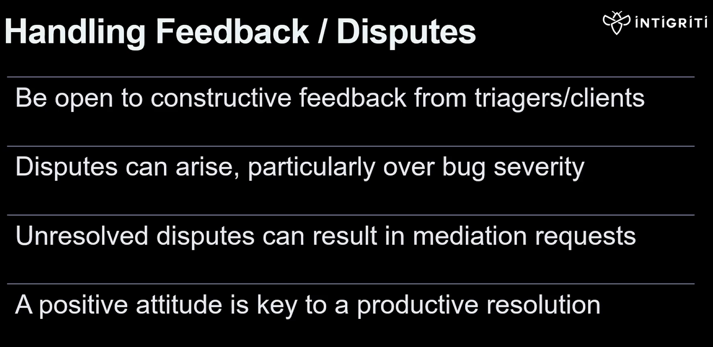

## Report Writting

Mostly the same as the PNPT stuff.  Geared more towards Web Application Penetration Test (WAPT).  A full report is more for a pentest than a bug bounty.  Need to look for a template if this is the format they want the report on for the exam.

## Vulnerability Reporting and Disclosure

Vulnerability Disclosure Program is a specific type of bug bounty that may not pay out in cash.  You can get recognition points and possibly some swag from them.  You can then use those rep points to get better assignments and work your way up to better opportunities.

## Effective Communication

Be consistent in your formatting when writing reports or disclosures.  
When doing bug bounty, always communicate through the program and NOT directly with the client by any means.  
Clarity, honesty, be patient and professional, don't be a dick :P  

