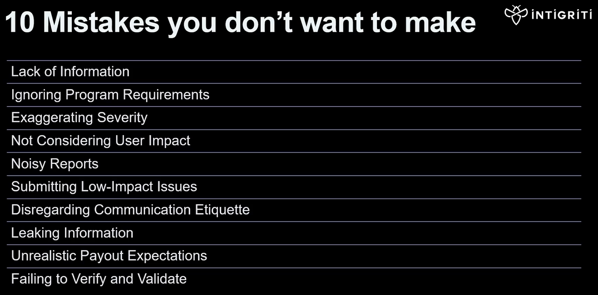

## Reporting No-No's

What not to do :)

### Lack of Info

Lack of detailed info.  
Not providing clear steps to reproduce.  
Incomplete proof of concept (PoC).  

### Ignoring Program Requirements

Ignoring the program scope.  
Ignoring program rules.  

### Exaggerating Severity

Overstating the severity of a vulnerability without proper evidence can lead to misallocation of resources.  
It's import for hunters to <b>accurately</b> assess and describe the <b>impact</b>.  

### Not Considering User Impact

Keep in mind to focus on impact, not just technical details.  If you find a bug but it has no impact, no bug.  
Triagers need to understand the broader context to assess the vulnerability's significance.

### Noisy Reports

Multiple reports for the same vulnerability with slightly different payloads.  
Consolidate information into a single, comprehensive report.

### Submitting Low-Impact Issues

Don't submit things like cosmetic errors as legitimate security issues.

### Disregarding Communication Etiquette

Don't be a dick!!

### Leaking Information

Don't do it!!

### Unrealistic Payout Expectations

Keep realistic expectations.  
Not following this can lead to disappointment.

### Failing to Verify and Validate

Double check and make sure the issue is still an issue when reporting.  
Not doing this can waste time and slow everyone down.
